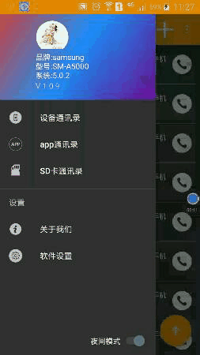

通讯录
=======

  

这是一款遵循材料设计(Material Design)的app，界面比较简单，代码仅供学习使用，代码还在不断完善

[项目下载](https://github.com/liangyongchen/CallPhone "点击跳转")   

## 特征

* 首页加载手机通讯录，app程序SQLite联系人数据，本地文件读取数据
* 实现个人中心头像切换
* app通讯录，手机通讯录添加联系人选择
* 电话拨打，短信发送
* 自定义主题颜色 无缝隙切换日间/夜间模式
* 导航栏颜色跟随主题颜色
* 清楚缓存
* 动态切换字体大小

## 预览

## Points

- 基本遵循 Material Design 设计风格
- MVP 框架
- Toolbar+DrawerLayout+NavigationView+Switch搭配只用
- RecyclerView 使用
- 使用源生夜间模式
- 使用RxBinding
- 封装一套完整的授权功能
- preference使用完成设置界面
- RxJava + Lambda 结合使用
- V层基类的构建, 包括 BaseActivity 和 BaseFragment , 对外提供了相同的接口
- styles使用夜间/日间模式:parent="Theme.AppCompat.DayNight.DarkActionBar"
- Slidr 框架使用，实现右滑退出Activity 
- 使用阿里巴巴矢量图文字iconfont
- 使用 material-dialogs 框架 实现 Toolbar颜色切换

## 描述

本人会一直更近维护该项目，直至完成所有功能

## 更新时间

### 2017.12.28

正式上传项目

哈哈
